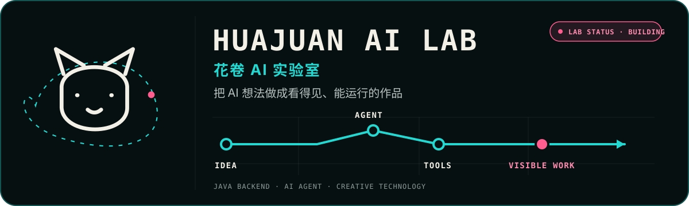

  <picture>
    <source media="(prefers-color-scheme: dark)" srcset="./assets/readme-hero-dark.svg">
    <source media="(prefers-color-scheme: light)" srcset="./assets/readme-hero-light.svg">
    
  </picture>

   

  <a href="https://wz20.github.io/wz20/"><strong>进入动态实验室 →</strong></a>
  &nbsp;·&nbsp;
  <a href="https://github.com/wz20?tab=repositories">查看全部项目</a>

## 你好，我是花卷

**Java 后端 · AI Agent · Creative Technology**

我喜欢把抽象的 AI 概念，做成看得见、能运行、可以继续迭代的产品、工具与视觉作品。

## 精选实验

<table>
  <tr>
    <td width="50%" valign="top">
      <h3>🔐 OAuth2 SSO Demo</h3>
      
用可运行示例拆解 GitHub 登录、OAuth2 授权与单点登录流程。

      <a href="https://github.com/wz20/OAuth2-sso-demo">查看项目 →</a>
    </td>
    <td width="50%" valign="top">
      <h3>🎬 VOX Paper Collage Video</h3>
      
自动生成 VOX 风格纸张拼贴视频，把素材、镜头与生产流程串成可复用管线。

      <a href="https://github.com/wz20/create-vox-paper-collage-video">查看项目 →</a>
    </td>
  </tr>
  <tr>
    <td width="50%" valign="top">
      <h3>🐱 Huajuan Illustrations</h3>
      
花卷猫咪极简插画素材库，用统一角色资产解释抽象技术概念。

      <a href="https://github.com/wz20/ian-huajuan-illustrations">查看项目 →</a>
    </td>
    <td width="50%" valign="top">
      <h3>🧭 Jinjing Skill</h3>
      
基于 Python 的路线规划 Skill，把自然语言意图转成可检查的工具执行结果。

      <a href="https://github.com/wz20/jinjing-skill">查看项目 →</a>
    </td>
  </tr>
</table>

## 当前研究

`AI Agent` · `LangGraph` · `MCP` · `Vibe Coding` · `视频自动化` · `视觉叙事`

## 代码活动

  
   
  

## 找到花卷

GitHub：[@wz20](https://github.com/wz20) · 抖音：[花卷AI实验室](https://www.douyin.com/search/%E8%8A%B1%E5%8D%B7AI%E5%AE%9E%E9%AA%8C%E5%AE%A4) · [动态实验室](https://wz20.github.io/wz20/)
