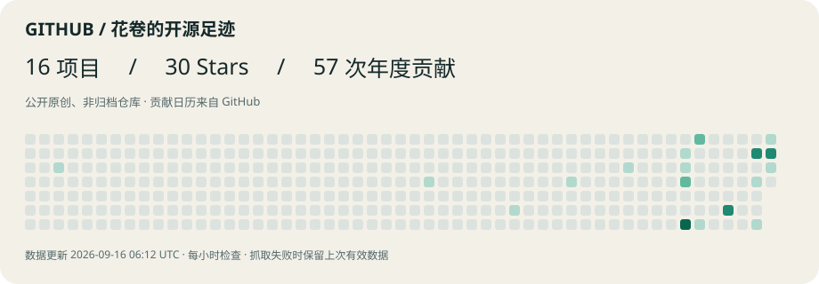

  <picture>
    <source media="(prefers-color-scheme: dark)" srcset="./assets/readme-hero-dark.svg">
    <source media="(prefers-color-scheme: light)" srcset="./assets/readme-hero-light.svg">
    
  </picture>

   

  <a href="https://wz20.github.io/wz20/"><strong>进入动态实验室 →</strong></a>
  &nbsp;·&nbsp;
  <a href="https://github.com/wz20?tab=repositories">查看全部项目</a>

## 你好，我是花卷

**Java 后端 · AI Agent · Creative Technology**

## 最新项目

<!-- PROFILE:START -->

最新公开项目 · 按创建时间从新到旧 · 每小时检查更新 数据更新时间：2026-09-18 00:29 UTC

<table>
<tr><td width="50%" valign="top"><h3>how-it-moves</h3>
★ 3 · Python

Technical animation Skill: strict content recipes, causal motion, offline HTML, silent video, and advanced authoring.
<a href="https://github.com/wz20/how-it-moves">查看项目 →</a></td>
<td width="50%" valign="top"><h3>huajuan-knowledge-cottage</h3>
★ 1 · TypeScript

花卷 · 知识小屋：可交互的3D Obsidian知识库看板，工作与休闲双面星球。Electron + Three.js + SQLite。
<a href="https://github.com/wz20/huajuan-knowledge-cottage">查看项目 →</a></td></tr>
<tr><td width="50%" valign="top"><h3>desktop-pet-delivery</h3>
★ 1 · JavaScript

将角色素材制作成独立 Windows / macOS 桌宠的 Codex Skill，附 Electron 模板、素材导入、安装包构建与清理流程。MIT 开源。
<a href="https://github.com/wz20/desktop-pet-delivery">查看项目 →</a></td>
<td width="50%" valign="top"><h3>huajuan-harness-cli</h3>
★ 7 · JavaScript

即放即用的 Agent Harness：把本地目录变成可自动进化、审阅与淘汰的知识工作区
<a href="https://github.com/wz20/huajuan-harness-cli">查看项目 →</a></td></tr>
</table>
<!-- PROFILE:END -->

## 当前研究

`AI Agent` · `LangGraph` · `MCP` · `Vibe Coding` · `视频自动化` · `视觉叙事`

## 代码活动

  <picture>
    <source media="(prefers-color-scheme: dark)" srcset="./assets/profile-activity-dark.svg">
    <source media="(prefers-color-scheme: light)" srcset="./assets/profile-activity-light.svg">
    
  </picture>

## 找到花卷

GitHub：[@wz20](https://github.com/wz20) · 抖音：[花卷AI实验室](https://www.douyin.com/search/%E8%8A%B1%E5%8D%B7AI%E5%AE%9E%E9%AA%8C%E5%AE%A4) · [动态实验室](https://wz20.github.io/wz20/)
