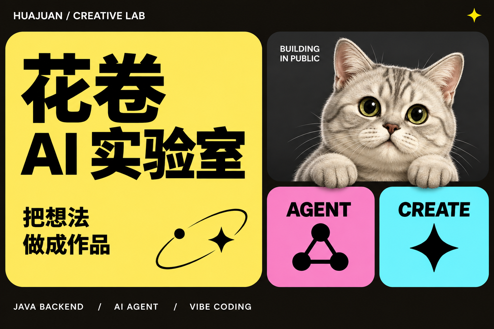
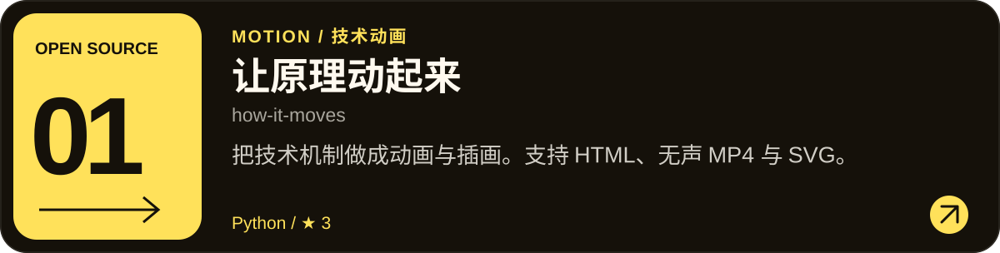
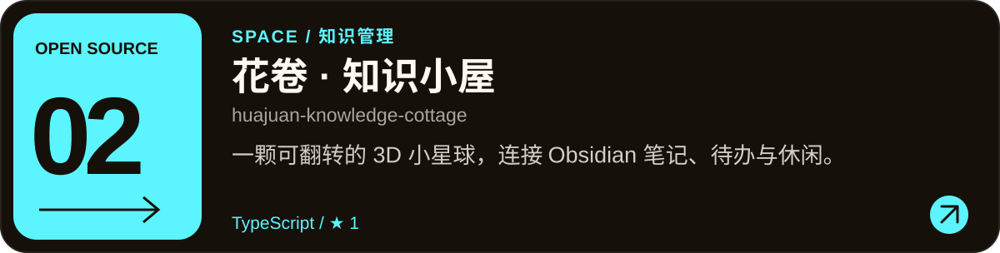
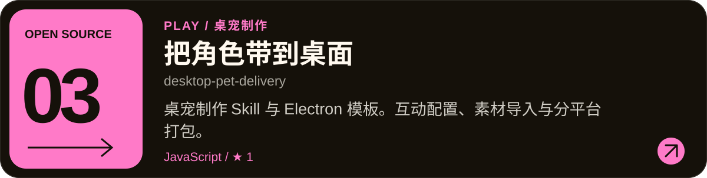
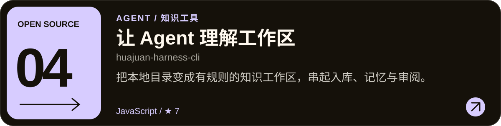

<a href="https://wz20.github.io/wz20/">进入动态实验室 ↗</a> &nbsp; / &nbsp; <a href="https://github.com/wz20?tab=repositories">全部开源项目 ↗</a>

<!-- PROFILE:START -->
<a href="https://github.com/wz20/how-it-moves"><picture><source media="(max-width: 600px)" srcset="./assets/profile-project-1-mobile.svg"></picture></a>

<a href="https://github.com/wz20/huajuan-knowledge-cottage"><picture><source media="(max-width: 600px)" srcset="./assets/profile-project-2-mobile.svg"></picture></a>

<a href="https://github.com/wz20/desktop-pet-delivery"><picture><source media="(max-width: 600px)" srcset="./assets/profile-project-3-mobile.svg"></picture></a>

<a href="https://github.com/wz20/huajuan-harness-cli"><picture><source media="(max-width: 600px)" srcset="./assets/profile-project-4-mobile.svg"></picture></a>

项目目录与更新说明

- **How It Moves · 让原理动起来**：把技术机制组织成动画与插画的制作 Skill，支持 HTML、无声 MP4 与 SVG；具体能力和案例边界见仓库说明。
- **花卷 · 知识小屋**：把本地 Obsidian 知识库搬进可翻转的 3D 小星球，串起笔记浏览、待办与休闲互动。提供 macOS Apple Silicon 安装包。
- **Desktop Pet Delivery · 桌宠制作**：把角色素材接入独立桌宠的 Codex Skill 与 Electron 模板，提供互动配置和打包流程；各平台成品需分别验收。
- **Huajuan Harness · Agent 工作区**：为本地目录配置知识入库、记忆维护与审阅流程，让 Agent 按工作区规则整理知识，并保留可检查的变更记录。

最新四个公开原创、非归档项目，按创建时间排序；每小时检查。数据更新时间：2026-10-09 02:19 UTC。

<!-- PROFILE:END -->

开源足迹 · 贡献与统计

 

<b>LET’S MAKE SOMETHING.</b> <a href="https://github.com/wz20">GitHub</a> &nbsp; / &nbsp; <a href="https://www.douyin.com/search/%E8%8A%B1%E5%8D%B7AI%E5%AE%9E%E9%AA%8C%E5%AE%A4">抖音 · 花卷AI实验室</a>

Based on <a href="https://github.com/shengjidaguai-china/personal-homepage-skill">Personal Homepage Skill</a> by powerycy · Creator Bento
