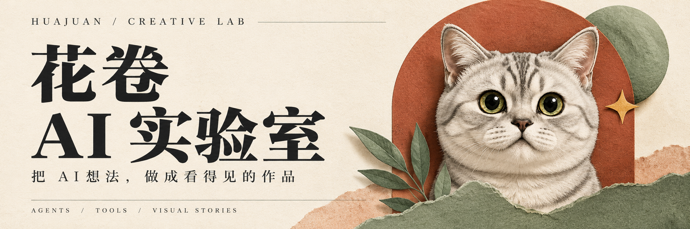
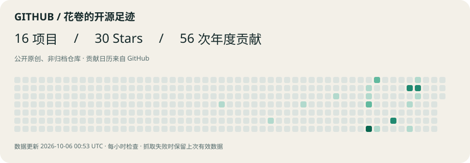

  
    
  <a href="https://wz20.github.io/wz20/"><strong>进入动态实验室 ↗</strong></a>
  &nbsp;&nbsp; / &nbsp;&nbsp;
  <a href="https://github.com/wz20?tab=repositories">浏览开源项目</a>

 

**你好，我是花卷。** Java 后端开发者，探索 AI Agent 与创意编程。 
这里是我的作品档案：让工具参与工作，让知识变得可见，让想法成为可以体验的软件。

 

## 近期作品 / Recent work

<!-- PROFILE:START -->
<h3>01 / How It Moves · 让原理动起来</h3>

 技术动画 · 历史案例演示

把技术机制组织成动画与插画的制作 Skill，支持 HTML、无声 MP4 与 SVG；具体能力和案例边界见仓库说明。

<a href="https://github.com/wz20/how-it-moves"><b>探索项目 ↗</b></a>　Python · ★ 3

 
<h3>02 / 花卷 · 知识小屋</h3>

 知识管理 · 实际应用演示

把本地 Obsidian 知识库搬进可翻转的 3D 小星球，串起笔记浏览、待办与休闲互动。提供 macOS Apple Silicon 安装包。

<a href="https://github.com/wz20/huajuan-knowledge-cottage"><b>探索项目 ↗</b></a>　TypeScript · ★ 1

 
<h3>03 / Desktop Pet Delivery · 桌宠制作</h3>

 桌宠制作 · 概念封面

把角色素材接入独立桌宠的 Codex Skill 与 Electron 模板，提供互动配置和打包流程；各平台成品需分别验收。

<a href="https://github.com/wz20/desktop-pet-delivery"><b>探索项目 ↗</b></a>　JavaScript · ★ 1

 
<h3>04 / Huajuan Harness · Agent 工作区</h3>

 Agent 工具 · 实际运行画面

为本地目录配置知识入库、记忆维护与审阅流程，让 Agent 按工作区规则整理知识，并保留可检查的变更记录。

<a href="https://github.com/wz20/huajuan-harness-cli"><b>探索项目 ↗</b></a>　JavaScript · ★ 7

关于这些项目与自动更新

最新公开原创、非归档项目，按创建时间排序；每小时检查。数据更新时间：2026-10-08 01:06 UTC。演示、概念封面与功能验证边界以各仓库说明为准。

<!-- PROFILE:END -->

 

## 持续探索 / In the making

**Agent 与工具** · 知识工作区、上下文维护、MCP 
**创意与表达** · 技术动画、视觉叙事、Vibe Coding

开源足迹 · 展开查看贡献与统计

 
<picture>
  <source media="(prefers-color-scheme: dark)" srcset="./assets/profile-activity-dark.svg">
  <source media="(prefers-color-scheme: light)" srcset="./assets/profile-activity-light.svg">
  
</picture>

 

---

**找到花卷** &nbsp; [GitHub](https://github.com/wz20) · [抖音 · 花卷AI实验室](https://www.douyin.com/search/%E8%8A%B1%E5%8D%B7AI%E5%AE%9E%E9%AA%8C%E5%AE%A4) · [动态实验室](https://wz20.github.io/wz20/)

Design adapted from <a href="https://github.com/shengjidaguai-china/personal-homepage-skill">Personal Homepage Skill</a> by powerycy · Magazine Portfolio
