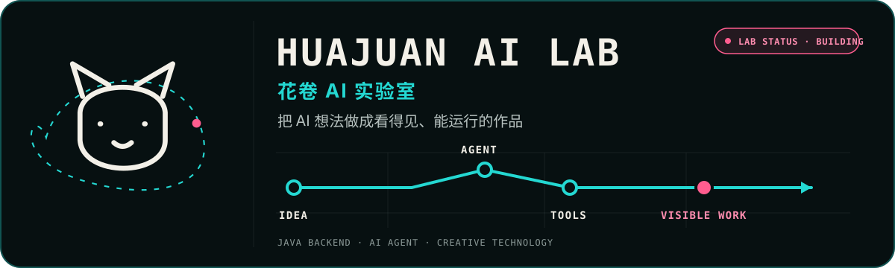

  <picture>
    <source media="(prefers-color-scheme: dark)" srcset="./assets/readme-hero-dark.svg">
    <source media="(prefers-color-scheme: light)" srcset="./assets/readme-hero-light.svg">
    
  </picture>

   

  <a href="https://wz20.github.io/wz20/"><strong>进入动态实验室 →</strong></a>
  &nbsp;·&nbsp;
  <a href="https://github.com/wz20?tab=repositories">查看全部项目</a>

## 你好，我是花卷

**Java 后端 · AI Agent · 创意编程**

把 AI 想法，做成看得见、能运行的作品。这里记录我围绕智能体、知识管理和视觉表达的开源实践。

- **让 AI 参与实际工作**：把知识整理、记忆维护和审阅流程做成可复用的 Agent 工具。
- **让软件更有趣**：把本地知识库做成 3D 小屋，探索桌宠与交互体验。
- **让技术更好理解**：用动画、插画和视频呈现机制，把创作流程沉淀为 Skill。

## 最新项目

从作品认识我。下面展示最近创建的四个公开原创项目，点击卡片查看使用方法、演示与验证记录。

<!-- PROFILE:START -->

最新公开项目 · 按创建时间从新到旧 · 每小时检查更新 数据更新时间：2026-10-08 01:06 UTC

<table>
<tr><td width="50%" valign="top"><h3>How It Moves · 让原理动起来</h3>
★ 3 · Python

把技术机制组织成动画与插画的制作 Skill，支持 HTML、无声 MP4 与 SVG；具体能力和案例边界见仓库说明。
<a href="https://github.com/wz20/how-it-moves">查看项目 →</a></td>
<td width="50%" valign="top"><h3>花卷 · 知识小屋</h3>
★ 1 · TypeScript

把本地 Obsidian 知识库搬进可翻转的 3D 小星球，串起笔记浏览、待办与休闲互动。提供 macOS Apple Silicon 安装包。
<a href="https://github.com/wz20/huajuan-knowledge-cottage">查看项目 →</a></td></tr>
<tr><td width="50%" valign="top"><h3>Desktop Pet Delivery · 桌宠制作</h3>
★ 1 · JavaScript

把角色素材接入独立桌宠的 Codex Skill 与 Electron 模板，提供互动配置和打包流程；各平台成品需分别验收。
<a href="https://github.com/wz20/desktop-pet-delivery">查看项目 →</a></td>
<td width="50%" valign="top"><h3>Huajuan Harness · Agent 工作区</h3>
★ 7 · JavaScript

为本地目录配置知识入库、记忆维护与审阅流程，让 Agent 按工作区规则整理知识，并保留可检查的变更记录。
<a href="https://github.com/wz20/huajuan-harness-cli">查看项目 →</a></td></tr>
</table>
<!-- PROFILE:END -->

## 当前研究

关注 Agent 如何使用工具、维护上下文，以及如何把一次性的创作过程变成可复用、可检查的工作流。

`AI Agent` · `LangGraph` · `MCP` · `Vibe Coding` · `视频自动化` · `视觉叙事`

## 代码活动

  <picture>
    <source media="(prefers-color-scheme: dark)" srcset="./assets/profile-activity-dark.svg">
    <source media="(prefers-color-scheme: light)" srcset="./assets/profile-activity-light.svg">
    
  </picture>

## 找到花卷

GitHub：[@wz20](https://github.com/wz20) · 抖音：[花卷AI实验室](https://www.douyin.com/search/%E8%8A%B1%E5%8D%B7AI%E5%AE%9E%E9%AA%8C%E5%AE%A4) · [动态实验室](https://wz20.github.io/wz20/)
