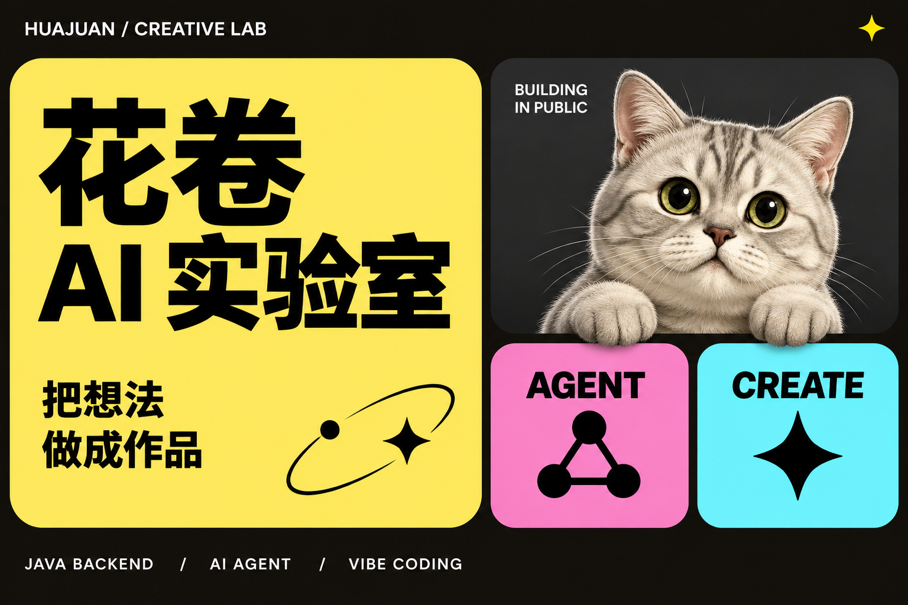
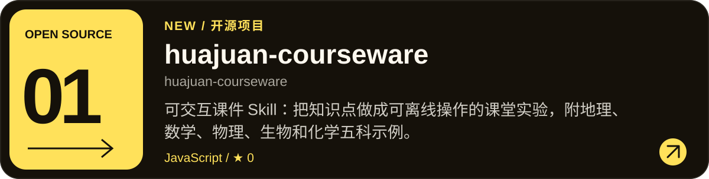
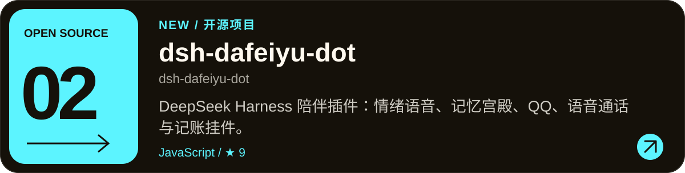
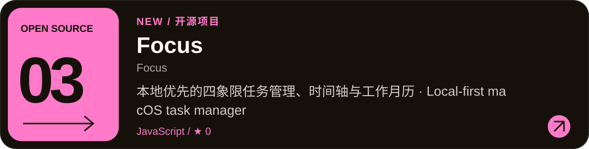
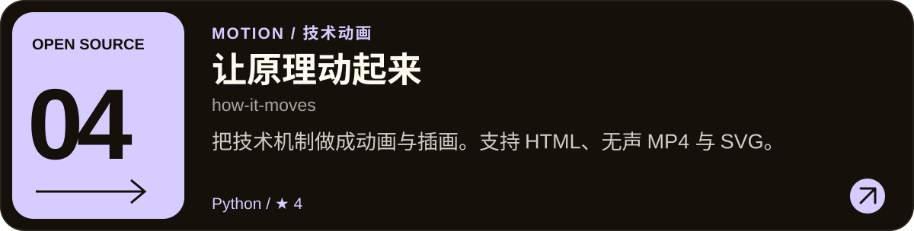
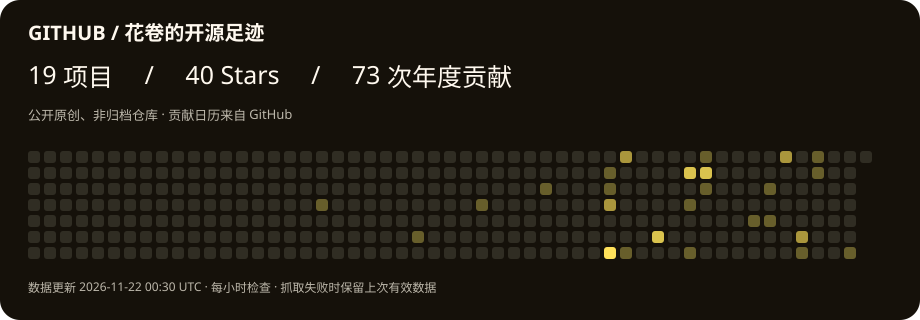

<a href="https://wz20.github.io/wz20/">进入动态实验室 ↗</a> &nbsp; / &nbsp; <a href="https://github.com/wz20?tab=repositories">全部开源项目 ↗</a>

<!-- PROFILE:START -->
<a href="https://github.com/wz20/huajuan-courseware"><picture><source media="(max-width: 600px)" srcset="./assets/profile-project-1-mobile.svg"></picture></a>

<a href="https://github.com/wz20/dsh-dafeiyu-dot"><picture><source media="(max-width: 600px)" srcset="./assets/profile-project-2-mobile.svg"></picture></a>

<a href="https://github.com/wz20/Focus"><picture><source media="(max-width: 600px)" srcset="./assets/profile-project-3-mobile.svg"></picture></a>

<a href="https://github.com/wz20/how-it-moves"><picture><source media="(max-width: 600px)" srcset="./assets/profile-project-4-mobile.svg"></picture></a>

项目目录与更新说明

- **huajuan-courseware**：可交互课件 Skill：把知识点做成可离线操作的课堂实验，附地理、数学、物理、生物和化学五科示例。
- **dsh-dafeiyu-dot**：DeepSeek Harness 陪伴插件：情绪语音、记忆宫殿、QQ、语音通话与记账挂件。
- **Focus**：本地优先的四象限任务管理、时间轴与工作月历 · Local-first macOS task manager
- **How It Moves · 让原理动起来**：把技术机制组织成动画与插画的制作 Skill，支持 HTML、无声 MP4 与 SVG；具体能力和案例边界见仓库说明。

最新四个公开原创、非归档项目，按创建时间排序；每小时检查。数据更新时间：2026-11-22 08:16 UTC。

<!-- PROFILE:END -->

开源足迹 · 贡献与统计

 

<b>LET’S MAKE SOMETHING.</b> <a href="https://github.com/wz20">GitHub</a> &nbsp; / &nbsp; <a href="https://www.douyin.com/search/%E8%8A%B1%E5%8D%B7AI%E5%AE%9E%E9%AA%8C%E5%AE%A4">抖音 · 花卷AI实验室</a>

Based on <a href="https://github.com/shengjidaguai-china/personal-homepage-skill">Personal Homepage Skill</a> by powerycy · Creator Bento
